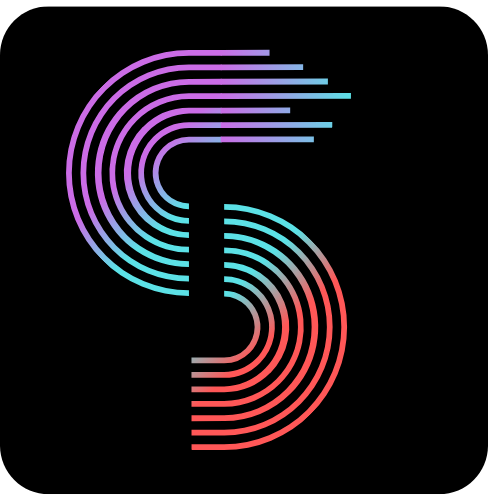

# Welcome

<h3>Stellar Community Fund #9</h3>

SmartArtists was selected by the #SCF Panel as one of the 35 projects to participate in the Community Discussion and Community Vote.

- [Find the project on the #SCF page](https://communityfund.stellar.org/projects/smartartists)
- [Join the #SCF discord Channel](https://discord.gg/JYuczS2v) if you have any question about SmartArtists and other amazing Stellar Projects

 

## Intro

#### Stellar DeFi powering a marketplace for non-standard NFTs

Hi **Stellar Lover**! 👋

Standard NFTs are great, but lack of a dynamic component:
> You buy one, and sell it at a higher price when it gets more "*valuable*"

What about:
> You buy one, and **continuosly** earn *as* it gets more "*valuable*"

That's where SmartArtistsNFTs, or **saNFTs** come into play.

